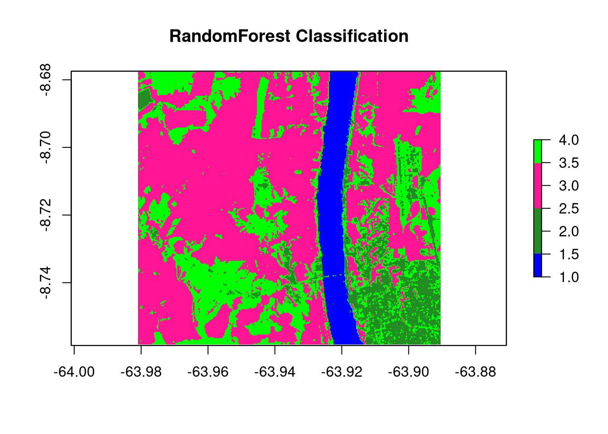

## Environment setup

All required R packages are listed alphabetically and installed together via the hidden `setup` chunk at the top of this R-markdown file. All packages and kernel versions are also listed using the `session_info()` command at the bottom of the markdown.

## Import AOI


::: {.cell}

```{.r .cell-code}
# assign master crs
crs_master    = sf::st_crs("epsg:4326")
# derive aoi windows
country   = geodata::gadm(country="GUY", level=0, path=tempdir()) |>
  sf::st_as_sf() |> sf::st_cast() |> sf::st_transform(crs_master)

states    = geodata::gadm(country="GUY", level=1, path=tempdir()) |>
  sf::st_as_sf() |> sf::st_cast() |> sf::st_transform(crs_master) |>
  dplyr::rename(State = NAME_1)

aoi    = dplyr::filter(states, State == "Barima-Waini") 

# visualize
tmap::tmap_mode("view")
tmap::tm_shape(states) + tmap::tm_borders(col = "white", lwd = 0.5) +
  tmap::tm_text("State", col = "white", size = 1, alpha = 0.3, just = "bottom") +
  tmap::tm_shape(country) + tmap::tm_borders(col = "white", lwd = 1) +
  tmap::tm_shape(aoi) + tmap::tm_borders(col = "red", lwd = 2) +
  tmap::tm_text("State", col = "red", size = 2) +
  tmap::tm_basemap("Esri.WorldImagery")
```

::: {.cell-output-display}
preserve182efaf8fbc1a6fb
:::
:::


## Supervised classification


::: {.cell}

```{.r .cell-code}
library(ForesToolboxRS)
# Data Preparation
dir.create("testdata")
# downloading the image
download.file("https://github.com/ytarazona/ft_data/raw/main/data/LC08_232066_20190727_SR.zip",
              destfile = "testdata/LC08_232066_20190727_SR.zip")
# unziping the image
unzip("testdata/LC08_232066_20190727_SR.zip", exdir = "testdata")
# downloading the signatures
download.file("https://github.com/ytarazona/ft_data/raw/main/data/signatures.zip",
              destfile = "testdata/signatures.zip")
# unziping the signatures
unzip("testdata/signatures.zip", exdir = "testdata")


# Read raster
image <- stack("testdata/LC08_232066_20190727_SR.tif")

# Read signatures
sig <- read_sf("testdata/signatures.shp")

# Classification with Random Forest
classRF <- mla(img = image, model = "randomForest", endm = sig, training_split = 80)

# Results
print(classRF)
```

::: {.cell-output .cell-output-stdout}

```
******************** ForesToolboxRS CLASSIFICATION ********************

****Overall Accuracy****
      Accuracy          Kappa  AccuracyLower  AccuracyUpper   AccuracyNull 
  9.843750e+01   9.791259e+01   9.159897e+01   9.996045e+01   2.812500e+01 
AccuracyPValue 
  9.083109e-32 

****Confusion Matrix****
                    1   2   3     4 Total Users_Accuracy Commission
1                  16   0   0  0.00    16      100.00000   0.000000
2                   0  14   0  1.00    15       93.33333   6.666667
3                   0   0  18  0.00    18      100.00000   0.000000
4                   0   0   0 15.00    15      100.00000   0.000000
Total              16  14  18 16.00    NA             NA         NA
Producer_Accuracy 100 100 100 93.75    NA             NA         NA
Omission            0   0   0  6.25    NA             NA         NA

****Classification Map****
class      : RasterLayer 
dimensions : 301, 337, 101437  (nrow, ncol, ncell)
resolution : 0.0002694946, 0.0002694946  (x, y)
extent     : -63.98125, -63.89043, -8.758574, -8.677456  (xmin, xmax, ymin, ymax)
crs        : +proj=longlat +datum=WGS84 +no_defs 
source     : memory
names      : layer 
values     : 1, 4  (min, max)
```


:::
:::

::: {.cell}

```{.r .cell-code}
# Classification
colmap <- c("#0000FF","#228B22","#FF1493", "#00FF00")
plot(classRF$Classification, main = "RandomForest Classification", col = colmap, axes = TRUE)#
```

::: {.cell-output-display}
{width=672}
:::
:::


## Monte Carlo Cross-Validation


::: {.cell}

```{.r .cell-code}
cal_ml <- calmla(img = image, endm = sig,
                 model = c("svm", "randomForest", "naiveBayes", "knn"),
                 training_split = 70, approach = "MCCV", iter = 10)
```
:::

::: {.cell}

```{.r .cell-code}
# Calibration result
plot(
  cal_ml$svm_mccv,
  main = "Monte Carlo Cross-Validation calibration",
  col = "darkmagenta",
  type = "b",
  ylim = c(0, 0.4),
  ylab = "Error between 0 and 1",
  xlab = "Number of iterations"
)
lines(cal_ml$randomForest_mccv, col = "red", type = "b")
lines(cal_ml$naiveBayes_mccv, col = "green", type = "b")
lines(cal_ml$knn_mccv, col = "blue", type = "b")
legend(
  "topleft",
  c(
    "Support Vector Machine",
    "Random Forest",
    "Naive Bayes",
    "K-nearest Neighbors"
  ),
  col = c("darkmagenta", "red", "green", "blue"),
  lty = 1,
  cex = 0.7
)
```

::: {.cell-output-display}
{width=672}
:::
:::
